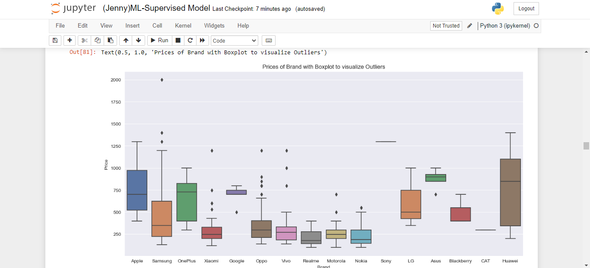

## 📱 Predicting Mobile Phone Sales with Machine Learning in Python 📊
### Case Study: Jenny Mobile phone distribution 
Check out my GitHub repository for a fascinating machine learning project! I've developed a supervised ML model in Python using popular libraries like sklearn to predict mobile phone sales for a distributor. Our approach includes linear regression, random forest regression, decision tree, and more. By leveraging historical sales data and various phone features, our models can accurately forecast sales for different mobile phone brands. Whether you're a tech enthusiast or a distributor seeking data-driven insights, this project offers valuable predictions to optimize inventory and marketing strategies. Jump in, explore the code, and discover how ML can revolutionize the mobile phone industry! Happy predicting! 🚀🔮 

 

 

 
